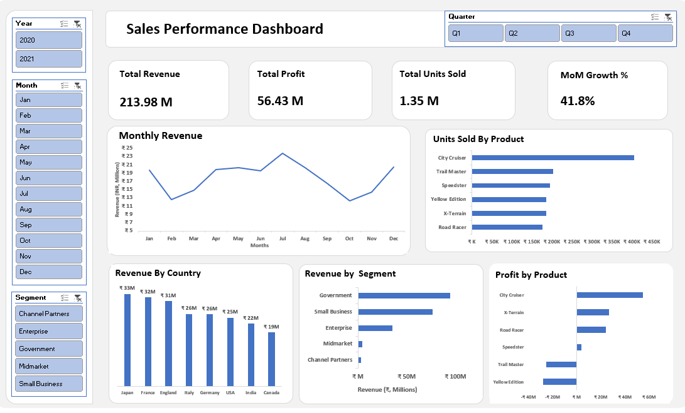

# Sales Performance Dashboard (Excel)

## 📌 Project Overview
This Excel dashboard provides an interactive view of sales performance across products, customer segments, and countries.  
It is built entirely using **Pivot Tables, Pivot Charts, GETPIVOTDATA, and Slicers**, following a clean and business-focused design.

The dashboard answers key business questions around revenue, profit, units sold, and monthly performance trends.

---

## 🛠 Key Features
- KPI Cards: Total Revenue, Total Profit, Total Units Sold, MoM Growth %
- Monthly Revenue Trend (Line Chart)
- Revenue by Country (Bar Chart)
- Revenue by Segment (Bar Chart)
- Units Sold by Product (Bar Chart)
- Profit by Product (Bar Chart)
- Dynamic slicers for Year, Month, Segment, and Quarter

---

## 📊 Insights Uncovered
### ✔ Revenue & Profit Performance  
Overall revenue shows a consistent upward trend with clear seasonal patterns.

### ✔ Product-Level Findings  
A small set of products contributes the majority of revenue and units sold.

### ✔ Negative Profit Items  
Some products produce negative profit, indicating potential pricing/cost issues.

### ✔ Segment & Country Performance  
Government and Small Business segments contribute the highest revenue.  
Certain countries outperform others consistently.

### ✔ Month-over-Month Trends  
MoM Growth % helps track improvement or decline in business performance.

---

## 🧩 Tools & Techniques Used
- Pivot Tables  
- Pivot Charts  
- GETPIVOTDATA  
- Slicers (interactive filtering)  
- Dashboard layout & design principles  
- KPI card creation  

---

## 📁 Files Included
- `Sales_Performance_Dashboard.xlsx` — Main dashboard  
- `dashboard_overview.png` — Dashboard preview image  
- `README.md` — Project documentation  
