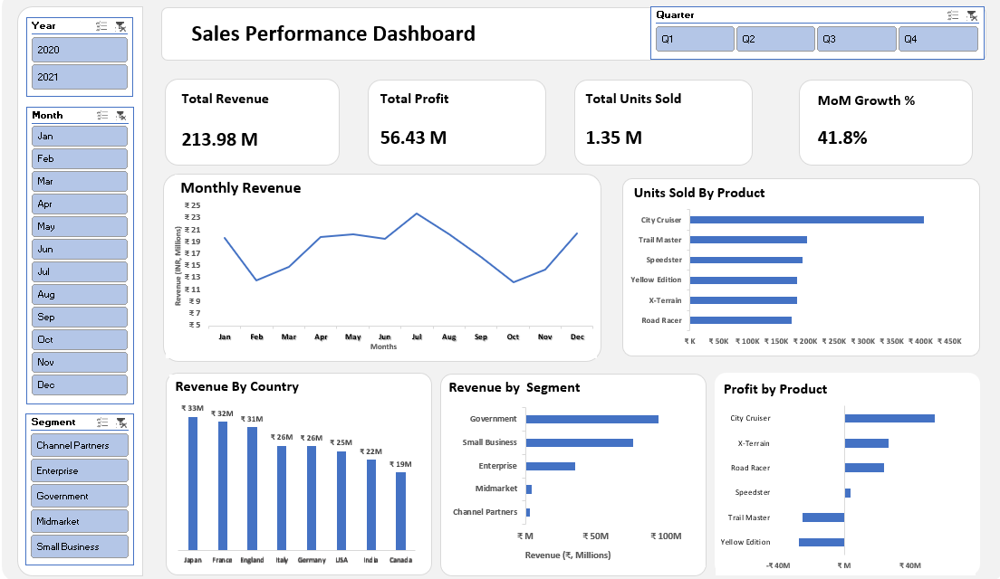

# Excel Projects

## Key Insights

- Identified high-revenue months, indicating clear seasonality in sales performance.
- A small number of products contribute the majority of total revenue and units sold.
- Certain products generate negative profit, highlighting potential pricing or cost issues.
- Specific customer segments and regions drive higher revenue compared to others.
- Month-over-Month growth analysis helps track business performance changes over time.
