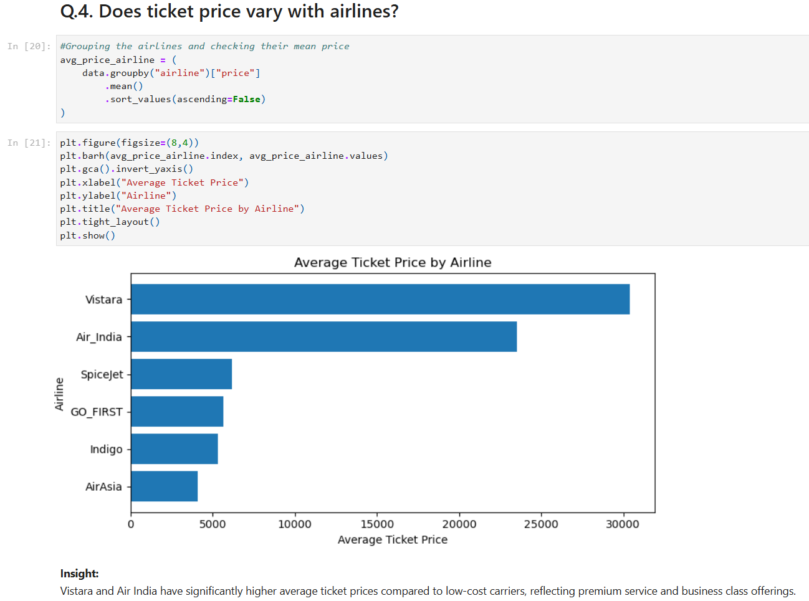

# Flight Ticket Pricing Analysis using Python

## 📌 Project Objective
Analyze flight ticket pricing data to understand the key factors influencing price variations across airlines, routes, travel class, and booking time.

The project focuses on extracting actionable business insights from real-world airline pricing data using Python-based analysis.

---

## 🛠 Key Analysis Performed
- Data loading, cleaning, and validation
- Exploratory Data Analysis (EDA)
- Airline-wise average ticket price comparison
- Business vs Economy class price analysis
- Impact of days left before departure on ticket prices
- Route-based and stop-based price variation analysis
- Data visualization using Python libraries

---

## 📊 Key Insights
- Premium airlines such as **Vistara** and **Air India** have significantly higher average ticket prices compared to low-cost carriers.
- **Business class** fares are consistently much higher than Economy class fares across all routes.
- Ticket prices increase sharply as the **departure date approaches**, indicating demand-based pricing.
- Routes and number of stops play a crucial role in determining ticket prices.
- Certain airlines follow consistent premium pricing strategies.

---

## 🧰 Tools & Libraries Used
- Python
- Pandas
- NumPy
- Matplotlib
- Seaborn

---

## 📁 Files Included
- `Flight_Ticket_Price_Analysis.ipynb` — Complete Jupyter notebook with analysis and visualizations
- `python_preview.png` — Dataset and analysis overview
- `python_chart_preview.png` — Airline-wise ticket price comparison chart
- `README.md` — Project documentation
